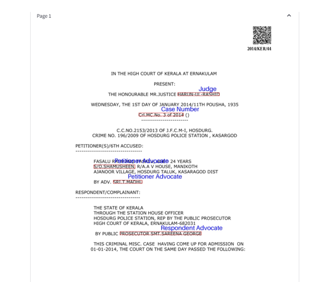
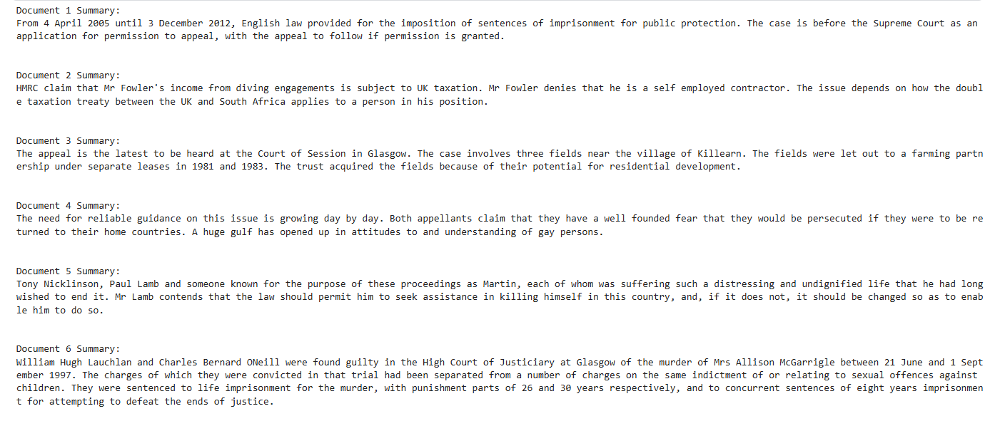

# Automated-Legal-Document-Analysis-and-Summarization
# 📑 Automated Legal Document Analysis and Summarization

This project provides an end-to-end solution for analyzing and summarizing scanned legal documents using a combination of OCR, LayoutLM, BERT, and BART models. It features a web interface built using Streamlit.

## 🚀 Features

- 🔍 **OCR (Tesseract & PaddleOCR):** Extracts text from scanned PDFs or images of legal documents.
- 📐 **Layout-Aware Classification (LayoutLM):** Understands the spatial and textual structure of documents for accurate classification.
- 🧠 **Text Classification (BERT):** Determines the type of legal document (e.g., contract, affidavit, notice).
- 📝 **Abstractive Summarization (BART):** Generates concise summaries of legal documents.
- 🌐 **Streamlit Web App:** A user-friendly interface to upload, classify, and summarize documents interactively.

---

## 🖼️ Sample Outputs

### LayoutLM Model Output

### BART Summarization Result

---

## 🗂️ Project Structure

